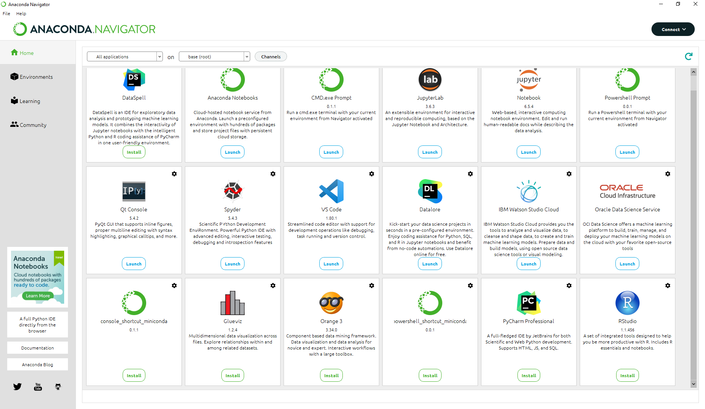

# GDAL-from-CONDA
Installing GDAL from Conda environment.

**GDAL** es una librería de Python considerada como de las más importantes en el mundo GIS, ya que aglomera más del 92% de geoprocesos básicos. Contiene algoritmos que nos permiten analizar datos geoespaciales. Lo mejor: es de código de uso libre.

 
 

# Instalación (Windows OS)

1. Descargar [**Anaconda**](https://www.anaconda.com/download).

 
 

2. Abrir el Powershell Prompt.

3. Instalando GDAL.

Para instalar esta librería correr lo siguiente en Conda:

conda install -c conda-forge gdal
conda install -c "conda-forge/label/TEST" gdal
conda install -c "conda-forge/label/broken" gdal
conda install -c "conda-forge/label/cf201901" gdal
conda install -c "conda-forge/label/cf202003" gdal
conda install -c "conda-forge/label/gcc7" gdal

